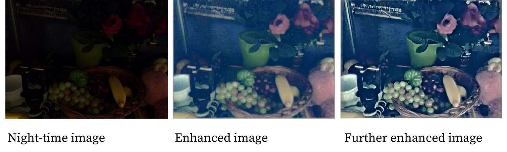
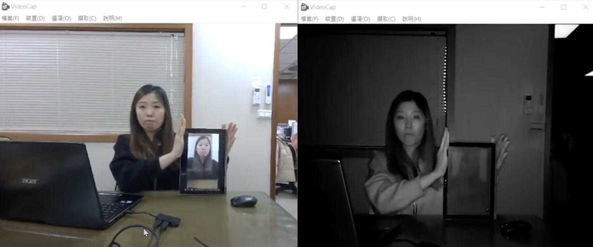
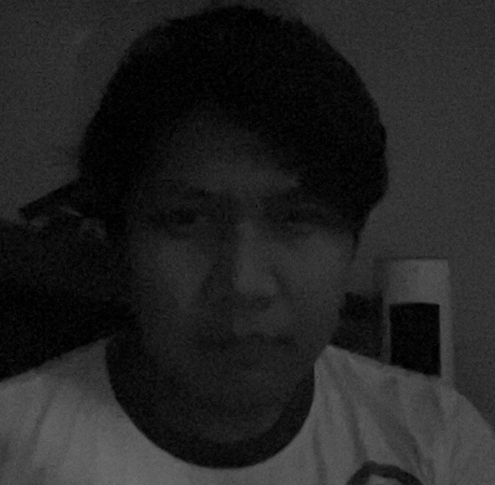
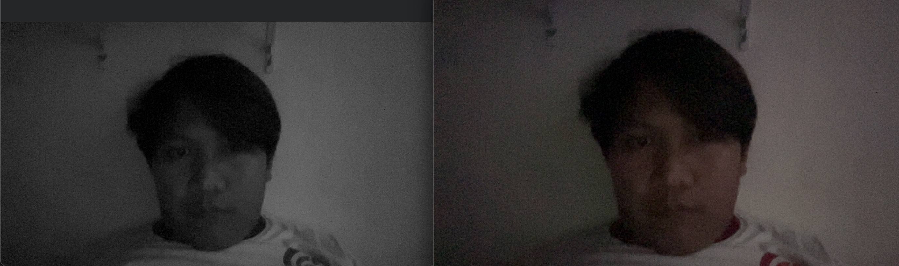
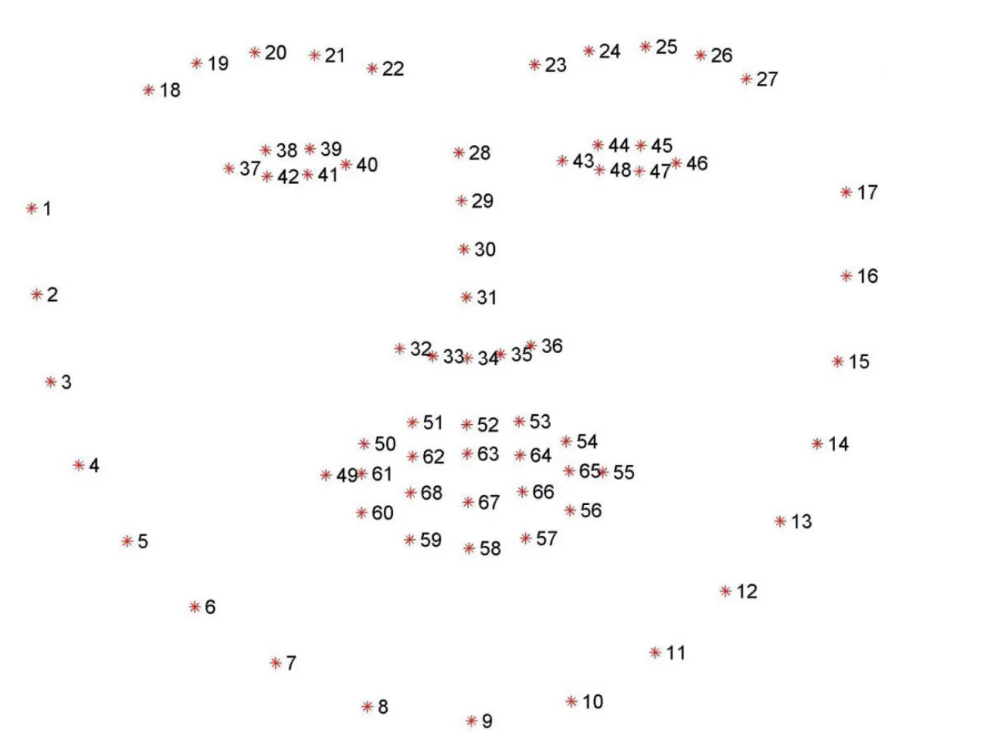
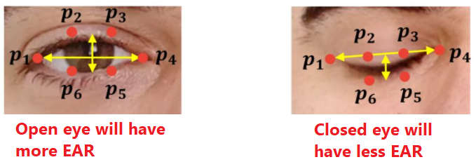
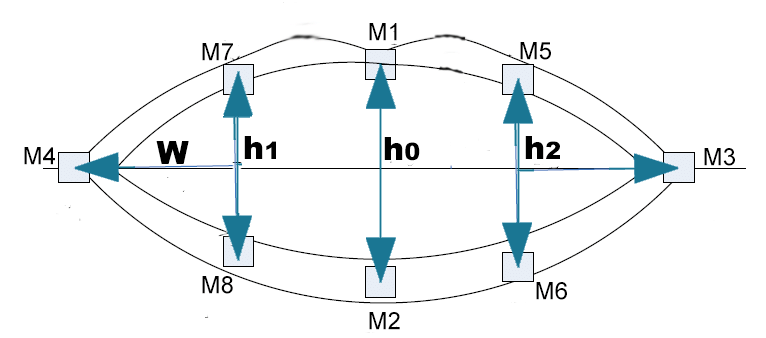
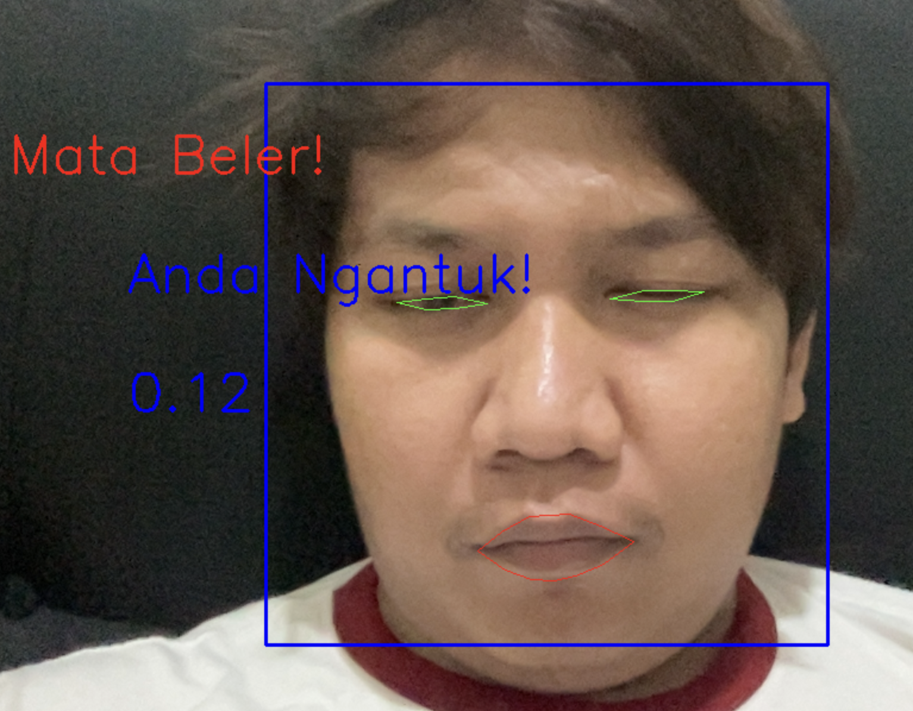
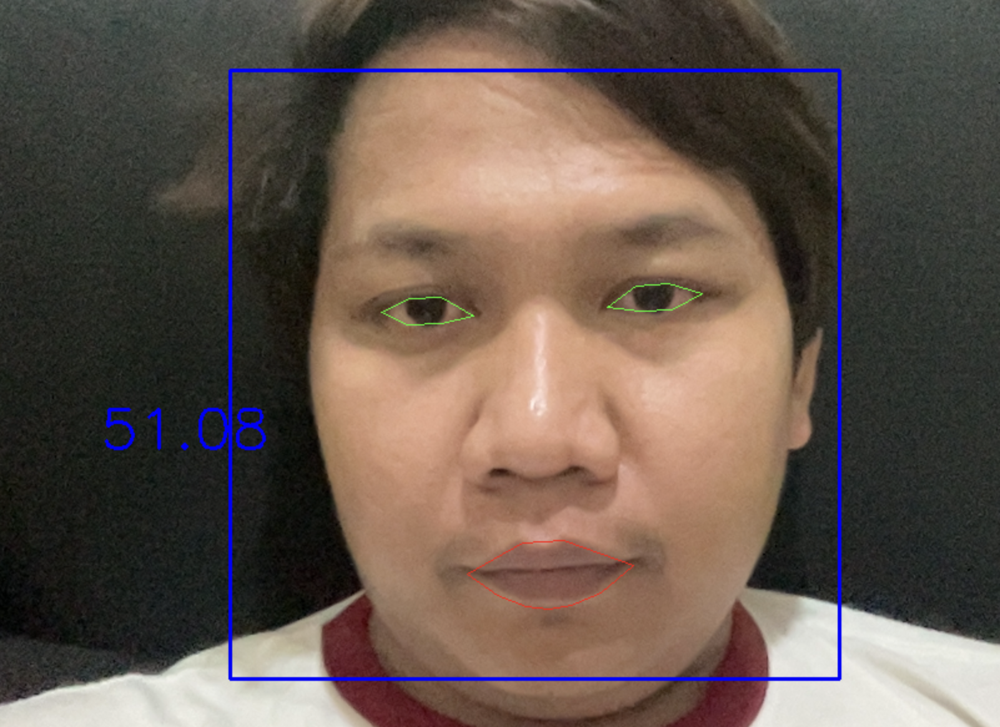
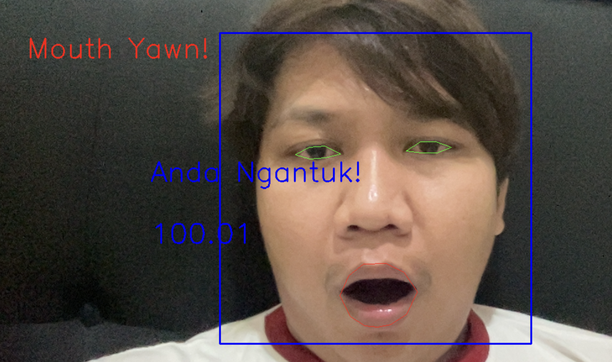

# ML PROJECTS TELEMATICS

## PROBLEMS TO TACKLE
### Improve image using preprocessing need a long time
- https://medium.com/visionwizard/ improving-illumination-in-night-time-images-fac8025f4bb7
- ref from above docs, need to 1-5 minutes for processing
- Need to do 7 Steps, to preprocessing image in night time:
  
- prefer to used infrared camera
- better no need image processing
- Comparation RGB vs Infrared Camera

## To doing now
- image preprocessing just only converted to gray contrast
- night time with lamp condition after preprocessing 
- night time without lamp condition after preprocessing
- comparation gray scaling vs RGB good lamp cond
- comparation gray scaling vs RGB notgood lamp cond
- detected Face Landmarks CV2 facelandmark 68 (x, y)-coordinates
- calculating eye euclidean AVG left eye & right eye
- calculating mouth euclidean 
- Make a condition when eyes euclidean < treshold 0.13 in 5 frame = 0.12 s (assume: camera speed 60fps)
- normal eyes
- drow eyes
- Make a condition when mouth euclidean > treshold 95 in 15 frame = 0.4 s (assume: camera speed 60fps) 
- normal mouth
- yawn mouth
- MAKING CONDITON TO JUDGMENT DROWSINESS, IF MOUTH YAWN OR EYES NEAR CLOSED, THEN DROWSINESS
- NOTES: this will not working properly in NG light conditions